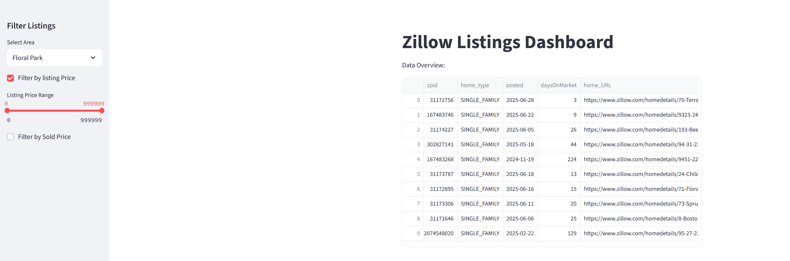
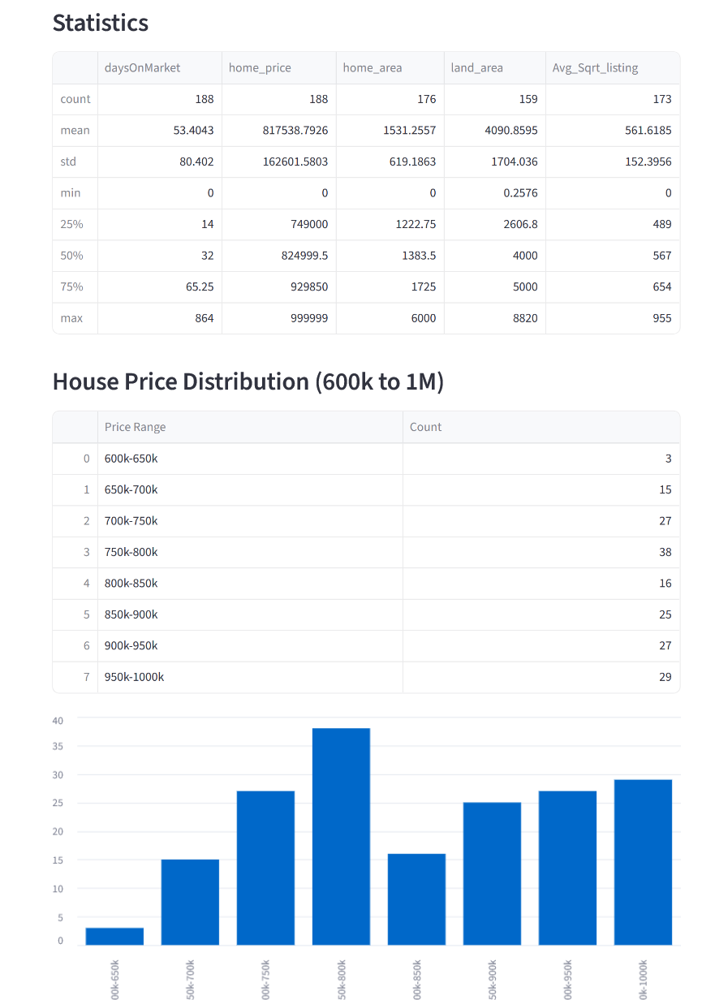
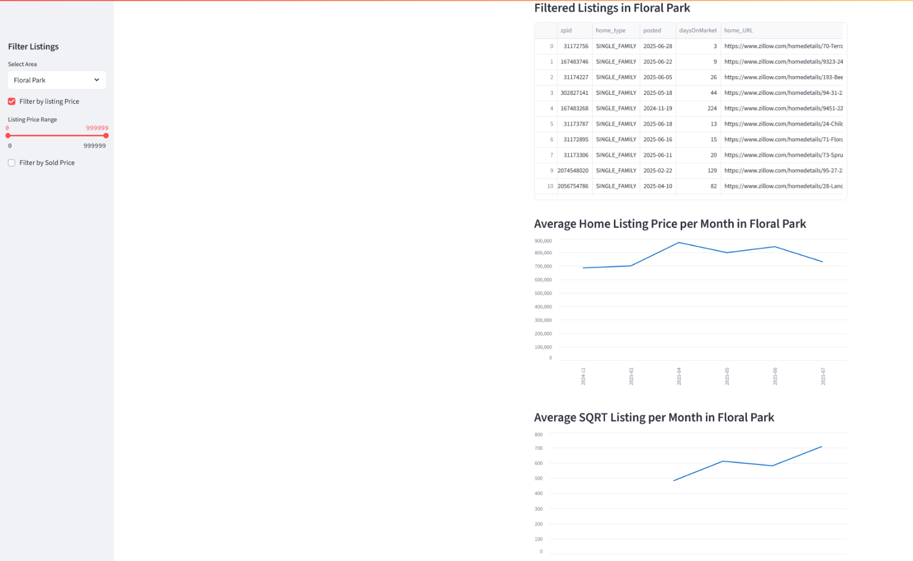
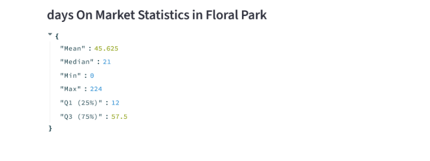

# Zillow Property Scraper

A Scrapy-based project to scrape Zillow real estate data for multiple neighborhoods, including both active listings and sold home details. It also downloads property images and merges data for comprehensive analysis.

## Project Purpose:

This project scrapes Zillow listings data to track housing market dynamics in near real-time. Since Zillow removes listings shortly after a house is sold, continuously collecting this data enables us to monitor price changes, time on market, and availability trends.
By analyzing this up-to-date and historical listing information, we can gain valuable insights into the short-term behavior of the housing market. This helps me to make informed, data-driven decisions when making offers.

## Features

- Scrapes multiple Zillow neighborhood URLs

- Filters homes by type (SINGLE_FAMILY and MULTI_FAMILY) and price (< $1,000,000)

- Extracts home details such as price, address, beds, baths, days on market, and more

- Downloads all carousel images for each property using Scrapy's ImagesPipeline

- Saves images organized by Zillow Property ID (zpid)

- Scrapes house sold data using a separate spider (zilsoldspider)

- Supports incremental JSON output with a custom pipeline that appends new records to existing JSON files without duplication

- Provides utilities for cleaning, merging, and analyzing scraped data using pandas, including handling missing values and date conversions

- Interactive Streamlit Dashboard:

        - Filter and explore listings by area and price range.

        - Visualize price distributions, monthly trends, and area statistics.

        - Analyze summary statistics (mean, median, min, max, quartiles) for home price and days on market.

        - Compare active listings and sold data with interactive charts and tables.

## Pipelines

- `ZillowImagesPipeline:` Saves images by zpid

- `AppendJsonPipeline:` Adds only new records to output.json (for zilspider only)

## Spiders

- `zilspider:` Scrapes active home listings (e.g., address, price, images)
- `zilsoldspider:`Scrapes recently sold home data (e.g., sold price, date sold, and listing duration)

## Usage

Run from the `zilspider`folder and scrape current listings:

    scrapy crawl zilspider

Run from the `zilspider`folder, scrape sold home data and export it to a JSON file:

    scrapy crawl zilsoldspider -O sold_homes.json

Run from the folder where `app.py` is

```
streamlit run app.py
```

# Zillow Dashboard

This Streamlit dashboard provides interactive visualizations and analytics for Zillow real estate data, including both active listings and sold properties. It is designed to help users explore housing market trends, price distributions, and property statistics by area and over time.


## DashBoard Visualizations:









## Notes

- This project is for educational purposes only.
- Zillow’s website structure may change, which could break the scraper. Use responsibly.
  
  


